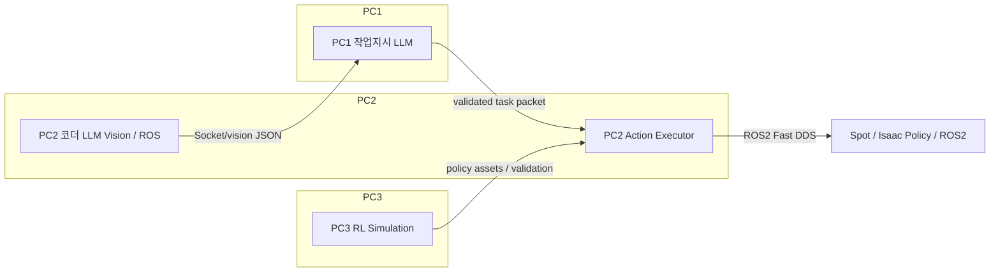

# 춘식이 화성가즈아
### (협동-3) 디지털 트윈 기반 로봇 자동화 시뮬레이션 시스템 구현
### 분산형 VLA 기반 로봇 에이전트 시스템

# 

로컬 3-PC 분산 로봇 제어 시스템으로, PC1 브레인 중심, PC2 비전/ROS/LLM 제어, PC3 Isaac Lab 기반 Spot 강화학습 시뮬레이션을 통합합니다.

## 개요 : Overview

`Chunsik VLA Brain Agent`는 다중 컴퓨터 환경에서 로봇 인지, 계획, 실행을 분리한 구조로 설계되었습니다. 주요 기능은 실시간 시각 데이터 수신, LLM 기반 작업 계획, ROS2 기반 로봇 액션 실행, Isaac Lab 정책 기반 강화학습 검증입니다.

## 특징점 : Key Features

- **PC1 Brain Center**: Streamlit UI와 Hermes 에이전트를 활용한 작업 패킷 생성, 검증, 전송
- **PC2 Vision + Action**: Florence-2와 OpenCV 기반 이미지 분석, WebSocket 통신, ROS2 네비게이션 및 정책 제어
- **PC3 RL Simulation**: Isaac Lab / Isaac Sim 환경에서 Spot 로봇 강화학습 및 원격 검증
- **WebSocket 기반 분산 통신**: PC1↔PC2 WebSocket으로 시각 데이터 및 작업 명령 정상화
- **정규화된 작업 패킷**: `environment`, `task`, `target`, `sequence`, `amr_pickup_pos`, `amr_drop_pos` 구조로 안전하게 전달

## 시스템 아키텍쳐 : System Architecture

### Component Summary

| 컴포넌트 | 역할 | 주요 기술 |
|---|---|---|
| PC1 | Brain Center / Task Planner / UI | Streamlit, websocket-client, Hermes Agent, AGENTS.md |
| PC2 | Vision, LLM, Robot Action Executor | Florence-2, Ollama, rclpy, ROS2, OpenCV, PyTorch |
| PC3 | Spot 강화학습 및 시뮬레이션 | Isaac Lab, Isaac Sim, PyTorch, RL 환경 구성 |

### Flow



### 주요 시퀀스 : Execution Sequence

1. PC2에서 카메라 캡처 및 Florence-2 이미지 분석 수행
2. 분석 결과(객체 목록, 캡션)를 PC1으로 전송
3. PC1에서 Hermes Agent와 AGENTS.md 기반으로 작업 패킷 생성/정규화
4. PC1이 PC2로 작업 패킷 전송
5. PC2가 ROS2/Isaac 정책을 통해 `move`, `pick`, `put` 기반 로봇 동작 수행
6. PC3에서 Spot 강화학습 정책을 학습 및 검증

## 개발환경 : Environment

- OS: Linux 기반 Isaac Lab 환경
- Middleware / Framework: ROS2 Humble, Isaac Lab / Isaac Sim
- Python: Python 3.x, Isaac Lab 전용 venv

## 하드웨어 사양 : Hardware Specifications

- 분산 시스템: RTX 5080 3대 PC 구성
  - PC1: Brain / UI / WebSocket 서버
  - PC2: Vision 분석 및 로봇 액션 실행
  - PC3: Spot 강화학습 및 시뮬레이션
- 로봇 에셋
  - Spot 4족 로봇 시뮬레이션
  - Doosan Arm 매니퓰레이터 USD 에셋
  - XT-32 LiDAR 및 통합 시뮬레이션 에셋
- 네트워크
  - PC1 WebSocket 서버: `192.168.10.23:8889`
  - PC2 명령 서버: `192.168.10.36:9999`

## 주요 패키지 : Dependencies

현재 소스에서 사용되는 주요 Python 패키지는 다음과 같습니다.

```text
rclpy
opencv-python
torch
transformers
Pillow
numpy
websocket-client
websockets
streamlit
streamlit-autorefresh
ollama
isaaclab
isaaclab_rl
isaaclab_tasks
isaaclab_assets
```

> 참고: ROS2 메시지 패키지(`nav2_msgs`, `geometry_msgs`, `sensor_msgs`, `std_srvs`)도 시스템에 설치되어 있어야 합니다.

## 설치 및 실행 가이드 :Installation & Launch Guide

1. 환경 활성화

```bash
source ~/dev_ws/venv/isaaclab/bin/activate
cd ~/dev_ws/isaac_sim/IsaacLab
```

2. Python 패키지 설치

```bash
pip install -r requirements.txt
```

3. PC1 Brain Center 실행

```bash
python src/pc1/vla_brain_center.py
```

4. PC2 Vision / Action Executor 실행

```bash
python src/pc2/final_code_2/code_llm_module8.py
```

5. PC3 Spot 강화학습 검증 실행

```bash
python src/pc3/Spot reinforcement learning/train/play.py --task Isaac-Velocity-Flat-Spot-v0 --num_envs=1 --checkpoint /path/to/model_39998.pt --teleop
```

6. Spot 강화학습 학습 실행

```bash
python src/pc3/Spot reinforcement learning/train/train.py --task Isaac-Velocity-Flat-Spot-v0
```

## 프로젝트 파일 : Project Structure

- `src/pc1/vla_brain_center.py` - PC1 브레인 UI 및 WebSocket 서버
- `src/pc1/AGENTS.md` - Hermes Agent 작업 설명 및 정책 템플릿
- `src/pc2/final_code_2/code_llm_module8.py` - PC2 LLM/로봇 액션 메인
- `src/pc2/final_code_2/capture_module.py` - 카메라 이미지 캡처 및 OpenCV 처리
- `src/pc2/final_code_2/move_controller_1.py` - ROS2 네비게이션/위치 복구 및 RL 이동 제어
- `src/pc2/final_code_2/extension.py` - Isaac Sim 정책 로딩 및 모듈 확장
- `src/pc3/Spot reinforcement learning/train/` - Spot RL 학습 및 실행 스크립트
- `src/pc3/Spot reinforcement learning/train/flat_env_cfg.py` - Spot RL 환경 구성
- `src/pc3/Spot reinforcement learning/train/play.py` - Isaac Sim 기반 검증/원격 조작 실행

## 아이작심 가상환경 설정 : Setting up a virtual environment


🔗 Google Drive:
https://drive.google.com/drive/folders/17X6YcaR7Ujpa4DRKTzW14duxZjD_fZxF?usp=drive_link

다운로드(Download):

본 프로젝트(Main Project) 웨어하우스 맵 :
c2_warehouse.zip

추가 프로젝트(Sub Project) 화성 맵: Collected_test_mars_map.zip

## Notes

- 실제 실행 환경은 Isaac Lab 전용 가상환경과 ROS2 Humble을 기준으로 합니다.
- WebSocket 주소는 소스 코드에 하드코딩되어 있으며, 네트워크 구성에 맞게 수정해야 합니다.
- `pick.pt`, `place.pt`, `move.pt` 정책 파일이 `src/pc2/final_code_2/`에 있어야 합니다.

-------------------------------------------------------------------------------- 
# PC1 작성지시 LLM

# 춘식이 VLA Brain Center README

이 문서는 **춘식이 VLA 프로젝트의 PC1 대뇌 계층**을 실행하기 위한 정리 문서입니다.
현재 구조는 PC2가 Vision/ROS 계층에서 환경 정보를 생성해 PC1로 보내고, PC1이 Hermes Agent + 로컬 DeepSeek-R1을 통해 Task JSON을 생성한 뒤 다시 PC2로 전송하는 방식입니다.

---

## 1. 전체 시스템 구조

```text
PC2 Vision/ROS Layer
- Camera / Florence-2 / YOLO / ROS2
- 환경 정보 JSON 생성
- PC1의 8889 포트로 전송

        ↓ WebSocket

PC1 VLA Brain Layer
- Streamlit 관제 UI
- Hermes CLI 호출
- AGENTS.md 기반 환경 추론
- DeepSeek-R1:14B-64K 로컬 추론
- Task JSON 파싱/검증
- PC2의 9999 포트로 전송

        ↓ WebSocket

PC2 Action/Cerebellum Layer
- Task JSON 수신
- ROS2 / Isaac Sim / 실제 로봇 실행 코드로 변환
```

현재 실행 파일은 **`vla_brain_center.py`**입니다.
예전에 사용하던 `hermes_agent.py`는 STT + ZeroMQ 실험용 구버전 파일이므로 현재 최종 구조에서는 사용하지 않습니다.

---

## 2. 주요 파일 구조

권장 디렉터리 구조:

```text
~/vla_brain/
├── vla_brain_center.py              # 최종 대뇌 실행 파일
├── AGENTS.md                        # Hermes가 읽는 환경/좌표/시나리오 규칙 파일
├── memory/
│   ├── pc1_parse_errors.jsonl       # PC1 파싱/검증 오류 기록
│   └── pc1_success_packets.jsonl    # 성공적으로 생성된 Task Packet 기록
└── README.md                        # 본 문서
```

### 파일별 역할

| 파일 | 역할 |
|---|---|
| `vla_brain_center.py` | Streamlit UI, PC2 환경정보 수신, Hermes 호출, JSON 검증, PC2 전송 |
| `AGENTS.md` | warehouse/farm/mars 규칙, 좌표, task, sequence 정의 |
| `memory/pc1_parse_errors.jsonl` | Hermes/LLM 출력이 JSON 파싱 실패했을 때 기록 |
| `memory/pc1_success_packets.jsonl` | 성공적으로 PC2로 보낸 Task JSON 기록 |
| `hermes_agent.py` | 구버전. 현재 최종 구조에서는 사용하지 않음 |

---

## 3. 현재 통신 포트

`vla_brain_center.py` 상단에서 설정합니다.

```python
PC2_WS_URL = "ws://<PC2_IP>:9999"
PC1_SERVER_PORT = 8889
```

의미:

```text
PC2 → PC1: 환경 정보 JSON 전송
          PC1이 8889 포트에서 수신

PC1 → PC2: Task JSON 전송
          PC2가 9999 포트에서 수신
```

예시:

```python
PC2_WS_URL = "ws://192.168.10.36:9999"
PC1_SERVER_PORT = 8889
```

실제 IP는 실행 환경에 맞게 반드시 확인해야 합니다.

---

## 4. PC2가 PC1로 보내야 하는 입력 JSON 포맷

PC2 Vision/ROS 계층은 PC1 `ws://<PC1_IP>:8889`로 아래 형태의 JSON 문자열을 전송합니다.

```json
{
  "objects": {
    "labels": ["box", "fire extinguisher", "light bulb"],
    "counts": {
      "box": 18,
      "fire extinguisher": 1,
      "light bulb": 12
    }
  },
  "caption": "The scene is an industrial warehouse with boxes, pallets, shelves, yellow walls, concrete floor, and overhead lights.",
  "source": "florence2",
  "timestamp": "2026-06-10T12:16:10"
}
```

필수 항목:

```text
objects.labels
caption
```

권장 항목:

```text
objects.counts
source
timestamp
```

주의:

```text
사람이 보는 로그 문자열이 아니라, 반드시 json.dumps()로 만든 JSON 문자열을 보내야 함.
caption이 너무 길면 LLM 추론이 느려질 수 있으므로 1~2문장 요약 권장.
```

---

## 5. PC1이 PC2로 보내는 출력 Task JSON 포맷

PC1은 Hermes 추론 결과를 파싱/검증한 뒤 PC2 `9999` 포트로 아래 형태를 전송합니다.

```json
{
  "environment": "warehouse",
  "task": "목표 상자를 흡착 그리퍼로 잡고 컨베이어 벨트까지 이동",
  "target": "box",
  "amr_pickup_pos": [-8.2, 3.0, 1.4],
  "amr_drop_pos": [2.0, 15.0, -0.2],
  "sequence": ["move_to_box", "suction_grasp", "move_to_conveyor", "release"],
  "confidence": 0.95,
  "reason": "상자와 창고 구조물이 감지되어 warehouse로 판단함",
  "recovery_hint": "인식이 불안정하면 카메라를 재정렬 후 재시도"
}
```

현재 warehouse 최신 좌표:

```text
amr_pickup_pos: [-8.2, 3.0, 1.4]
amr_drop_pos:   [2.0, 15.0, -0.2]
```

warehouse sequence에서 `search_qr`는 제거되었습니다.

---

## 6. AGENTS.md 관리 방식

`AGENTS.md`는 Hermes가 읽는 핵심 규칙 파일입니다.
좌표나 task sequence를 바꾸고 싶으면 우선 이 파일을 수정합니다.

### 최신 warehouse 설정

```md
warehouse:
task: 목표 상자를 흡착 그리퍼로 잡고 컨베이어 벨트까지 이동
target: box
amr_pickup_pos: [-8.2, 3.0, 1.4]
amr_drop_pos: [2.0, 15.0, -0.2]
sequence: ["move_to_box", "suction_grasp", "move_to_conveyor", "release"]
```

주의:

```text
Hermes 출력이 정상일 때는 AGENTS.md의 좌표가 우선 사용됨.
코드 내부 fallback template이 남아 있다면, Hermes 출력 실패 시 fallback 좌표가 사용될 수 있음.
따라서 실제 환경 좌표를 완전히 최신화하려면 AGENTS.md와 코드 내부 FALLBACK_ENV_TEMPLATES를 함께 확인하는 것이 안전함.
```

---

## 7. 의존성 설치

### 7.1 Python 가상환경

현재 터미널에서는 `hermes_env`를 사용하는 흐름으로 정리합니다.
기존 컴퓨터에서 가상환경 이름이 `hermes_enc`라면 해당 이름으로 바꿔서 실행하면 됩니다.

```bash
cd ~
python3 -m venv hermes_env
source ~/hermes_env/bin/activate
python -m pip install --upgrade pip
```

### 7.2 Python 패키지 설치

```bash
pip install streamlit ollama websockets websocket-client streamlit-autorefresh
```

현재 Hermes CLI 버전에서는 Python 코드가 직접 `ollama.chat()`을 쓰지 않더라도, 기존 코드 호환을 위해 `ollama` 패키지는 설치해두는 것을 권장합니다.

---

## 8. Docker Ollama 설정

### 8.1 Ollama 컨테이너 실행 확인

```bash
docker ps
```

`ollama-brain`이 보이지 않으면:

```bash
docker start ollama-brain
```

### 8.2 Ollama API 확인

```bash
curl http://127.0.0.1:11434/v1/models
```

정상 예시:

```json
{
  "data": [
    {"id": "deepseek-r1:14b-64k"}
  ]
}
```

### 8.3 64K 모델이 없을 때 생성

먼저 기본 모델이 있는지 확인합니다.

```bash
docker exec -it ollama-brain ollama list
```

`deepseek-r1:14b`는 있는데 `deepseek-r1:14b-64k`가 없다면:

```bash
docker exec -i ollama-brain sh -c 'cat > /tmp/Modelfile.deepseek-r1-14b-64k' <<'MODELFILE'
FROM deepseek-r1:14b
PARAMETER num_ctx 65536
MODELFILE

docker exec -it ollama-brain ollama create deepseek-r1:14b-64k -f /tmp/Modelfile.deepseek-r1-14b-64k
```

생성 확인:

```bash
docker exec -it ollama-brain ollama list
```

---

## 9. Hermes 설정

### 9.1 Hermes 명령어 확인

```bash
hermes --help
```

정상적으로 help가 나오면 Hermes CLI 설치가 된 상태입니다.

### 9.2 Hermes 모델 설정

```bash
hermes setup model
```

선택값:

```text
Provider: Custom endpoint
API base URL: http://127.0.0.1:11434/v1
API key: ollama
API compatibility mode: Chat Completions
Model: deepseek-r1:14b-64k
```

설정 확인:

```bash
hermes config | grep -i -E "model|provider|url|context"
```

예상:

```text
Model: deepseek-r1:14b-64k
Provider: custom
Base URL: http://127.0.0.1:11434/v1
API mode: chat_completions
```

### 9.3 Hermes 단독 테스트

`~/vla_brain` 경로에서 실행해야 `AGENTS.md`를 잘 읽습니다.

```bash
cd ~/vla_brain
hermes -z 'Read AGENTS.md and follow it strictly. Return only one valid JSON object. Vision: objects box x3, shelves x1. Caption: warehouse with boxes and shelves.'
```

정상이라면 JSON이 출력됩니다.

---

## 10. 실행 순서

PC1에서 실행합니다.

```bash
cd ~/vla_brain
source ~/hermes_env/bin/activate

docker start ollama-brain
curl http://127.0.0.1:11434/v1/models

streamlit run vla_brain_center.py
```

브라우저 접속:

```text
Local URL:   http://localhost:8501
Network URL: http://<PC1_IP>:8501
```

실행 시 PC1은 자동으로 8889 포트에서 PC2 환경 정보를 기다립니다.

---

## 11. 정상 동작 로그 예시

PC2가 환경 정보를 보내면 PC1 터미널에 다음과 같이 표시됩니다.

```text
[PC 1] PC 3 수신용 백그라운드 서버 시작 (포트: 8889)
server listening on 0.0.0.0:8889
connection open
[PC 1] PC 3와 연결 성공! 데이터 대기 중...
```

버튼을 눌러 Task를 생성하면:

```text
[Hermes 백엔드] AGENTS.md 기반 Task JSON 생성 및 검증 완료.
[Hermes Tool] 코더 컴퓨터로 최종 기획서 전송 시도: ws://<PC2_IP>:9999
[Hermes Tool] 소뇌 전송 완료!
```

---

## 12. 중복 실행 방지

Streamlit 버튼을 두 번 누르면 Task가 두 번 생성될 수 있습니다.
최신 코드에서는 아래 방식으로 중복을 방지하는 것을 권장합니다.

### 12.1 session_state 추가

세션 초기화 부분에 아래 항목이 있어야 합니다.

```python
if 'run_requested' not in st.session_state:
    st.session_state['run_requested'] = False
if 'is_analyzing' not in st.session_state:
    st.session_state['is_analyzing'] = False
if 'pending_vision_input' not in st.session_state:
    st.session_state['pending_vision_input'] = ""
if 'last_sent_payload_hash' not in st.session_state:
    st.session_state['last_sent_payload_hash'] = ""
if 'last_send_blocked' not in st.session_state:
    st.session_state['last_send_blocked'] = False
```

### 12.2 버튼 동작 방식

권장 흐름:

```text
버튼 클릭
→ run_requested=True 저장
→ st.rerun()
→ 버튼 비활성화 상태에서 실제 Hermes 실행
→ 실행 완료 후 is_analyzing=False
```

### 12.3 동일 Task Packet 전송 차단

`hermes_tool_send_to_pc2()` 내부에서 payload hash를 저장해 동일 JSON이면 전송하지 않도록 합니다.

```python
payload_hash = json.dumps(validated_payload, ensure_ascii=False, sort_keys=True)

if st.session_state.get("last_sent_payload_hash") == payload_hash:
    print("[Hermes Tool] 동일 Task Packet 중복 전송 차단")
    st.session_state["last_send_blocked"] = True
    return False
```

---

## 13. 오류 해결 가이드

### 13.1 Hermes APIConnectionError / Connection error

증상:

```text
Endpoint: http://127.0.0.1:11434/v1
Error: Connection error
API call failed after 3 retries
```

원인:

```text
Ollama 컨테이너가 꺼져 있거나 11434 포트가 열려 있지 않음.
```

해결:

```bash
docker start ollama-brain
curl http://127.0.0.1:11434/v1/models
```

그래도 안 되면 포트 매핑 확인:

```bash
docker ps | grep ollama-brain
```

출력에 아래 형태가 있어야 합니다.

```text
0.0.0.0:11434->11434/tcp
```

---

### 13.2 request exceeds available context size 4096

증상:

```text
request exceeds the available context size (4096 tokens)
```

원인:

```text
deepseek-r1:14b 기본 4K 모델을 호출 중.
AGENTS.md + caption + 오류 로그가 4096 토큰을 초과함.
```

해결:

```text
Hermes model을 deepseek-r1:14b-64k로 변경.
필요하면 memory 오류 로그를 비움.
```

명령:

```bash
hermes setup model
# model: deepseek-r1:14b-64k

> ~/vla_brain/memory/pc1_parse_errors.jsonl
```

---

### 13.3 출력에서 JSON 객체를 찾을 수 없습니다

증상:

```text
[Hermes 백엔드] 에러 감지: Hermes 출력에서 JSON 오브젝트를 찾을 수 없습니다.
```

원인:

```text
Hermes/LLM이 설명문, markdown, <think>만 출력하고 JSON을 출력하지 않음.
AGENTS.md 규칙이 약하거나, prompt가 너무 복잡함.
```

해결:

1. `AGENTS.md`에 아래 규칙이 있는지 확인:

```md
Return only one valid JSON object.
Never return markdown.
Never include explanations outside JSON.
Never wrap JSON in code fences.
```

2. Hermes 단독 테스트:

```bash
cd ~/vla_brain
hermes -z 'Read AGENTS.md and follow it strictly. Return only one valid JSON object. Vision: box, shelves, warehouse.'
```

3. 너무 긴 caption을 PC2에서 요약해서 보내도록 수정.

---

### 13.4 PC2 전송 실패: Connection refused

증상:

```text
[Hermes Tool] 소뇌 전송 실패: [Errno 111] Connection refused
```

원인:

```text
PC2의 9999 WebSocket 서버가 안 켜져 있음.
PC2 IP 또는 포트가 틀림.
```

확인:

PC2에서:

```bash
ss -lntp | grep 9999
```

Windows라면:

```powershell
netstat -ano | findstr 9999
```

PC1에서:

```bash
nc -vz <PC2_IP> 9999
```

해결:

```text
PC2 수신 서버 실행.
PC2_WS_URL을 실제 PC2 IP와 포트로 수정.
```

---

### 13.5 PC2/PC1 연결이 계속 끊겼다 붙음

증상:

```text
connection open
연결 성공
연결 종료됨
connection open
연결 성공
```

원인:

```text
PC2 송신 코드가 send → ACK 수신 → close 방식이면 정상적인 현상.
```

결과를 정상적으로 받아오면 치명적인 문제는 아닙니다.
실시간 연결 유지가 필요하면 PC2 송신 코드를 persistent WebSocket loop 구조로 바꾸면 됩니다.

---

### 13.6 Streamlit missing ScriptRunContext 경고

증상:

```text
Thread 'Thread-6': missing ScriptRunContext! This warning can be ignored when running in bare mode.
```

원인:

```text
Streamlit 백그라운드 WebSocket 서버 스레드에서 발생하는 경고.
```

해결:

```text
현재 통신과 추론에는 영향이 없으므로 무시 가능.
```

---

### 13.7 AGENTS.md 좌표를 바꿨는데 반영이 안 됨

확인할 것:

1. Streamlit을 재시작했는지 확인.

```bash
Ctrl + C
streamlit run vla_brain_center.py
```

2. `vla_brain_center.py`가 Hermes 호출 시 `cwd="~/vla_brain"`에서 실행되는지 확인.

3. 코드 내부 fallback template이 옛 좌표를 갖고 있지 않은지 확인.

4. Hermes 단독 테스트로 AGENTS.md 반영 여부 확인.

```bash
cd ~/vla_brain
hermes -z 'Read AGENTS.md and follow it strictly. Vision: warehouse with boxes. Return only one valid JSON object.'
```

---

### 13.8 속도가 너무 느림

원인:

```text
DeepSeek-R1 14B는 reasoning 모델이라 Hermes CLI 경유 시 느릴 수 있음.
caption이 길거나 AGENTS.md가 길면 더 느림.
```

해결:

```text
caption을 1~2문장으로 요약.
pc1_parse_errors.jsonl이 너무 크면 비움.
필요 시 qwen 계열 경량 모델로 교체.
```

오류 로그 초기화:

```bash
> ~/vla_brain/memory/pc1_parse_errors.jsonl
```

---

## 14. 빠른 상태 점검 명령어

```bash
# 1. venv 진입
source ~/hermes_env/bin/activate

# 2. Ollama 컨테이너 확인
docker ps | grep ollama-brain

# 3. Ollama API 확인
curl http://127.0.0.1:11434/v1/models

# 4. Hermes 설정 확인
hermes config | grep -i -E "model|provider|url|context"

# 5. Hermes 단독 테스트
cd ~/vla_brain
hermes -z 'Return only JSON: {"environment":"mars"}'

# 6. PC2 포트 확인
nc -vz <PC2_IP> 9999

# 7. Streamlit 실행
streamlit run vla_brain_center.py
```

---

## 15. 데모 전 체크리스트

```text
[ ] PC1에서 docker start ollama-brain 완료
[ ] curl http://127.0.0.1:11434/v1/models 정상
[ ] Hermes model이 deepseek-r1:14b-64k로 설정됨
[ ] AGENTS.md warehouse 좌표 최신화됨
[ ] PC2_WS_URL이 실제 PC2 IP:9999로 설정됨
[ ] PC2에서 9999 WebSocket 수신 서버 실행 중
[ ] PC2가 PC1 8889 포트로 환경 JSON 전송 가능
[ ] Streamlit UI에서 Vision Text 갱신 확인
[ ] 버튼은 한 번만 클릭
[ ] PC2 수신 로그에서 Task JSON 1회 수신 확인
```

---

## 16. 현재 최신 warehouse 시나리오 요약

```text
Environment: warehouse
Target: box
Task: 목표 상자를 흡착 그리퍼로 잡고 컨베이어 벨트까지 이동
Pickup: [-8.2, 3.0, 1.4]
Drop: [2.0, 15.0, -0.2]
Sequence:
  1. move_to_box
  2. suction_grasp
  3. move_to_conveyor
  4. release
```

`search_qr` 단계는 현재 제거되었습니다.


-------------------------------------------------------------------------------- 
# 미구현 프로젝트 기능

# Spot-Doosan Arm Locomotion & Manipulation Execution Guide (README)


1. 개발 및 가상환경 활성화 (Environment Setup)
--------------------------------------------------------------------------------
본 프로젝트는 Isaac Lab 전용 가상환경(venv) 및 ROS2 Humble 아키텍처 상에서 구동됩니다.
시뮬레이션 및 학습 스크립트를 실행하기 전, 새 터미널을 열고 아래 명령어를 순서대로 
입력하여 가상환경 활성화 및 작업 디렉토리 진입을 수행하십시오.

$source ~/dev_ws/venv/isaaclab/bin/activate$ cd ~/dev_ws/isaac_sim/IsaacLab

💡 [TIP] 매번 입력하기 번거롭다면 '~/.bashrc' 맨 아래에 단축어(alias)를 등록하세요:
$ gedit ~/.bashrc
(맨 아랫줄에 다음 추가 후 저장)
alias goisaac="source ~/dev_ws/venv/isaaclab/bin/activate && cd ~/dev_ws/isaac_sim/IsaacLab"

등록 후 터미널에 'goisaac'만 입력하면 환경 활성화와 디렉토리 이동이 동시에 수행됩니다.


2. 프로젝트 주요 파일 및 에셋 위치 (Project Structure)
--------------------------------------------------------------------------------
순정 Isaac Lab 패키지 상태에서는 Doosan Arm 무게중심 튜닝 모델 및 커스텀 에셋이 누락되어
있습니다. 프로젝트 클론 후 반드시 아래 커스텀 파일들을 지정된 경로에 배치하십시오.

1) 로봇 및 시뮬레이션 환경 설정 (Python Config & Scripts)
   * 4족 로봇 상벌점 및 환경 가중치 설정 파일 세트:
     ├── isaaclab_tasks/manager_based/locomotion/velocity/config/spot/flat_env_cfg.py
     └── isaaclab_tasks/manager_based/locomotion/velocity/config/spot/__init__.py
     ※ Doosan Arm 하중(stand_still_scale=25.0) 최적화 및 태스크 등록 정보가 반영된 핵심 파일입니다.

   * 터미널 명령어 인자(Arguments) 파싱 및 학습 제어 유틸리티:
     └── scripts/reinforcement_learning/rsl_rl/cli_args.py
     ※ 이어학습(--resume), 가중치 로드(--checkpoint) 등 터미널 명령어를 제어하는 매개체입니다.

   * 학습 메인 실행 스크립트:
     ├── scripts/reinforcement_learning/rsl_rl/train.py
     └── scripts/reinforcement_learning/rsl_rl/play.py

2) 3D 로봇 및 센서 에셋 (USD Files)
   * Spot 로봇 원본 및 Doosan Arm, XT-32 라이다 결합용 3D 에셋 위치:
     └── ~/dev_ws/isaac_sim/src/
         ├── my_spot.usd              (순정형 Spot 4족 로봇 원본 에셋)
         ├── robot_arm.usd            (Doosan Arm 매니퓰레이터 단독 에셋)
         ├── XT-32.usd                (상단 장착형 3D 라이다 센서 에셋)
         └── my_spot_arm_visual.usd   (Spot + 라이다 + 로봇팔이 최종 결합된 시뮬레이션 메인 에셋)
   ※ 주의: 시뮬레이션 구동 시 위 4개 USD 파일이 반드시 'src' 폴더 내에 함께 존재해야 
     조인트 및 비주얼 링크 붕괴 현상이 발생하지 않습니다.

3) 최종 학습 완료 가중치 파일 (PyTorch Model)
   * 복사할 목적지 경로:
     └── ~/dev_ws/isaac_sim/IsaacLab/logs/rsl_rl/spot_flat/2026-06-11_09-53-39/model_39998.pt
   ※ Mean Reward 397.51을 달성하여 보행 및 제자리 정지 밸런스가 완비된 최적의 소뇌(Policy) 모델 가중치입니다.


3. 강화학습 실행 가이드 (Reinforcement Learning)
--------------------------------------------------------------------------------
※ 대규모 병렬 환경 구동 시 메모리 부족(Killed) 에러가 발생할 수 있습니다.
   이를 방지하기 위해 'flat_env_cfg.py' 내에서 병렬 환경 수를 최적화(num_envs = 64)하고,
   Linux Swap 가상 메모리(32GB)를 확보한 후 학습을 진행하는 것을 권장합니다.

A. 처음부터 새롭게 학습을 시작할 때 (Scratch Training)
   $ python scripts/reinforcement_learning/rsl_rl/train.py --task Isaac-Velocity-Flat-Spot-v0

B. 기존에 중단된 체크포인트부터 이어서 파인튜닝할 때 (Resume Training)
   $ python scripts/reinforcement_learning/rsl_rl/train.py --task Isaac-Velocity-Flat-Spot-v0 --resume --load_run 2026-06-11_09-53-39 --checkpoint "model_.*"


4. 모델 검증 및 원격 제어 (Play & Teleoperation)
--------------------------------------------------------------------------------
학습이 완료된 인공신경망 정책(Policy) 파일(*.pt)의 물리 거동을 시뮬레이터에서 검증하고,
키보드 또는 조이스틱 인터페이스를 활용해 Spot 로봇을 원격으로 수동 조종하는 명령어입니다.

$ python scripts/reinforcement_learning/rsl_rl/play.py --task Isaac-Velocity-Flat-Spot-v0 --num_envs=1 --checkpoint /home/rokey/dev_ws/isaac_sim/IsaacLab/logs/rsl_rl/spot_flat/2026-06-11_09-53-39/model_39998.pt --teleop


5. 제어 공학적 팁: 영점 흐름 방지 (Deadzone Filter)
--------------------------------------------------------------------------------
강화학습 모델 수렴 이후, 영점 지령(정지 상태) 시 로봇이 미세 노이즈나 과보정 여파로 
인해 '좌측 전방'으로 조금씩 밀려 나가는 미세 흐름 현상이 관찰될 수 있습니다.

이를 해결하기 위해 모델을 처음부터 다시 재학습하지 말고, 로봇을 구동하는 최상위 파이썬 
제어 스크립트(Hermes 상위 에이전트 혹은 Task 시퀀서단) 내 환경 step 함수 호출 직전에 
아래와 같이 데드존(Deadzone) 필터 코드를 주입하여 완전 고정 메커니즘을 완성하십시오.

[적용 코드 스니펫 예시]
--------------------------------------------------------------------------------
raw_cmd_x = commands[0]  # 전진 지령 속도
raw_cmd_y = commands[1]  # 좌우 지령 속도

# 0.05 m/s 이하의 미세한 흐름 노이즈 속도는 강제로 완전 정지(0) 처리
filtered_cmd_x = 0.0 if abs(raw_cmd_x) < 0.05 else raw_cmd_x
filtered_cmd_y = 0.0 if abs(raw_cmd_y) < 0.05 else raw_cmd_y

# 최종 필터링된 지령을 소뇌 정책 신경망(Policy) 입력값으로 주입
env.step(action_or_commands=[filtered_cmd_x, filtered_cmd_y, cmd_yaw])
--------------------------------------------------------------------------------

이 보정 필터는 'suction_grasp'(흡착 잡기) 및 'search_qr'(QR 스캔) 태스크 진입 시 
로봇 바디를 강력하게 홀딩시켜 전체 하이브리드 자율 주행 시퀀스의 성공률을 극대화합니다.
================================================================================

